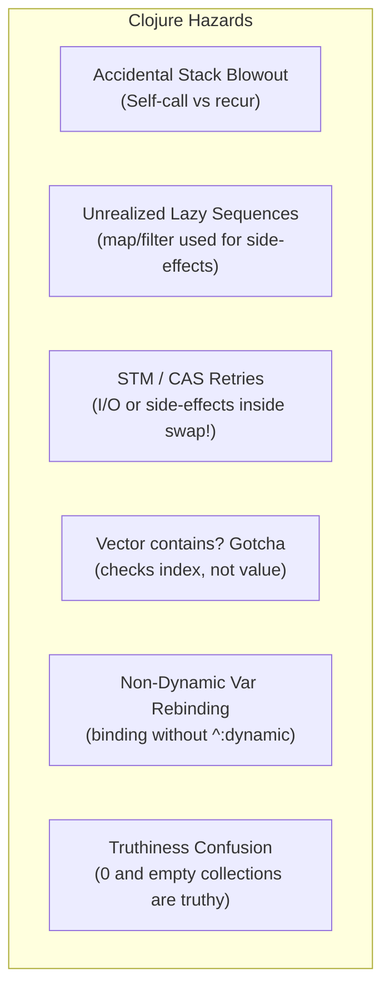
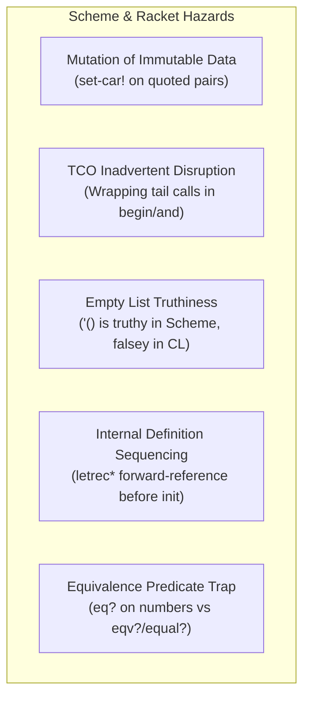
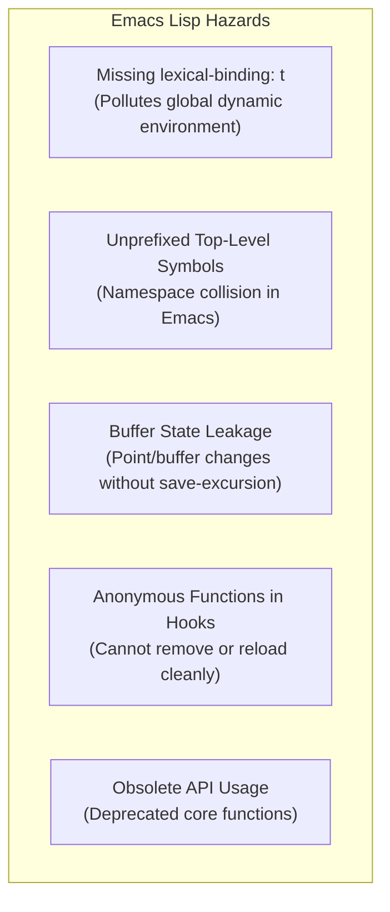
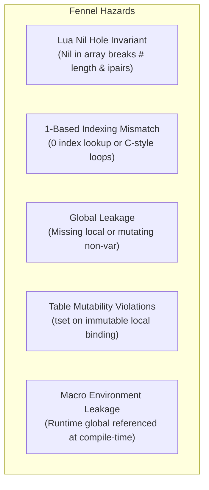

# Static Code Analysis Gaps & Multi-Dialect Roadmap

> Comprehensive analysis of uncaught bugs, semantics hazards, and AST-level detection strategies across Lisp-family dialects for `structural-editing-mcp`.

---

## 1. Executive Summary & Current Coverage Baseline

`structural-editing-mcp` provides structural analysis in [`src/analysis.lisp`](../src/analysis.lisp) covering:
- **Surface Syntax Simplification**: Single-clause `cond` to `when`, `if ... nil` to `when`, `if not` to `unless`, redundant `progn`, nested `let` to `let*`, `equal ... nil` to `null`.
- **Structural Metrics**: Cyclomatic branch complexity, AST nesting depth, total node count.
- **Clone Detection**: Exact and structural subtree duplication.
- **Lexical Binding Analysis**: Unused parameters/variables and lexical shadowing across `let`, `defun`/`defn`, `lambda`, `multiple-value-bind`, and loops.

### The Gap
Current analysis is primarily **syntactic and cosmetic**. It does not catch **runtime correctness hazards**, **undefined behavior under ANSI standards**, **macro hygiene vulnerabilities**, or **dialect-specific concurrency/runtime traps**.

The following sections catalog these gaps across all 5 supported dialects, accompanied by concrete AST detection heuristics.

---

## 2. Common Lisp: Uncaught Hazards & Anti-Patterns

### 2.1 Critical Runtime & Undefined Behavior (ANSI CL Violations)

| Hazard | Description & Impact | AST Detection Pattern |
| :--- | :--- | :--- |
| **Mutation of Literal Constants** (ANSI CL §3.7.1) | Destructive functions (`nconc`, `sort`, `delete`, `setf` on `car`/`cdr`) called on quoted data (`'(...)`) or constants. In SBCL, causes memory write-faults, segfaults, or code corruption. | `(nconc '(?...) ...)` or `(delete ?x '(?...))` or `(setf (car '(?...)) ...)` |
| **Ignored Destructive Return Value** | Sequence modifiers (`delete`, `sort`, `nreverse`, `nintersection`) do *not* guarantee in-place mutation of the head of a list. Calling them without capturing their return value drops list elements. | Node is `(delete ...)`, `(sort ...)`, `(nreverse ...)` where parent is `progn`, `defun` body, or statement position where the value is dropped. |
| **Inappropriate Equality Predicates** | Using `eq` on numbers, characters, or strings instead of `=`, `char=`, `string=`, or `equal`. Under ANSI CL, whether `(eq 1000 1000)` is `T` is implementation-dependent. | `(eq ?x <number>)`, `(eq ?x <string>)`, `(eq ?x <char>)`, or checking symbols with `equal`. |
| **Associative Lookup Equality Default** | `(assoc key alist)` or `(member item list)` defaults to `eql`. Searching strings or complex keys without `:test #'equal` or `:test #'string=` silently fails to match. | `(assoc <string> ...)` or `(member <string> ...)` with no `:test` keyword argument. |

### 2.2 Macro Hygiene & Metaprogramming

| Hazard | Description & Impact | AST Detection Pattern |
| :--- | :--- | :--- |
| **Unhygienic Variable Capture** | Macro introducing bindings in expanded code using fixed symbols instead of `gensym` or `alexandria:with-gensyms`. Causes silent variable shadowing at call sites. | `defmacro` body containing a backquoted `let`/`let*` whose binding names are literal symbols rather than comma-escaped forms `,var`. |
| **Multiple Evaluation of Macro Arguments** | Expanding a macro argument form into the expansion multiple times without binding it to a local temporary variable. Arguments with side effects (`(pop x)`) execute multiple times. | Macro parameter symbol `,?arg` occurs more than once inside the template without an intervening binding. |
| **Declaration Placement Errors** | `declare` expressions placed outside valid declaration positions (e.g. after executable statements in `let` or `defun`), turning them into dead no-op code. | `(declare ...)` appearing at index $\ge 1$ after an executable form in a body. |

### 2.3 Dynamic Scope & Global State

| Hazard | Description & Impact | AST Detection Pattern |
| :--- | :--- | :--- |
| **Earmuff Convention Violations** | `(defvar name ...)` or `(defparameter name ...)` without asterisks (`*name*`). In CL, this makes the symbol **globally special** across all packages and threads, turning any future local `(let ((name ...)))` into a dynamic binding. | `(defvar ?name ...)` or `(defparameter ?name ...)` where `?name` does not match `^\*.*\*$`. |
| **Dead Clauses in Conditionals** | Clauses placed after an unconditional default clause (`t` or `otherwise`) in `cond` or `case`. | In `cond`, any clause following `(t ...)` or `(otherwise ...)`. |
| **Dead Code after Non-Local Exits** | Expressions placed after unconditional `(return-from ...)`, `(throw ...)`, or `(error ...)`. | In a sequence body, any form following an unconditional exit. |

### 2.4 Exception Safety & Resource Leaks

| Hazard | Description & Impact | AST Detection Pattern |
| :--- | :--- | :--- |
| **Unprotected Streams & Handles** | Raw `open` or mutex lock acquisitions without `unwind-protect`, `with-open-file`, or `bordeaux-threads:with-lock-held`. Non-local jumps leave file descriptors and locks orphaned. | Call to `(open ...)` not enclosed in `unwind-protect` or `close`. |
| **Format Control String Mismatches** | Directives in control strings (`~A`, `~S`, `~D`) do not match the number or types of passed arguments. Only discovered when error paths run. | Count `~` directives in literal format strings and compare to argument count. |

---

## 3. Clojure & ClojureScript: Dialect-Specific Gaps

Clojure runs on the JVM/JS runtimes and possesses distinct semantics around persistent data structures, concurrency primitives, and lazyness.



### 3.1 Concurrency & Persistent State Hazards

* **Side-Effects inside `swap!`, `alter`, or `dosync`**:
  * *The Issue*: Clojure's software transactional memory (STM) and atomic references use optimistic retry loops. If a transaction conflicts, the update function executes again.
  * *Danger*: Putting I/O, network requests, logging, or state mutation inside `(swap! my-atom (fn [state] (send-email) (inc state)))` causes duplicated side-effects.
  * *AST Detection*: Any call to `swap!`, `reset-vals!`, `alter`, `commute`, or `dosync` whose body or passed function contains calls to known I/O or mutating operators (`println`, `spit`, `http/post`, `assoc!`).

* **Unsafe Dynamic Rebinding (`binding` on non-dynamic vars)**:
  * *The Issue*: `(binding [v val] ...)` requires the target var to be explicitly annotated with `^:dynamic`.
  * *Danger*: Calling `binding` on a standard `(def v 1)` raises a runtime `IllegalStateException: Can't dynamically bind non-dynamic var`.
  * *AST Detection*: Check `binding` target symbols against workspace `def` forms for the `^:dynamic` metadata tag.

### 3.2 Laziness & Flow Hazards

* **Self-Call Recursion without `recur` (Stack Overflow)**:
  * *The Issue*: The JVM does not support tail-call optimization (TCO). A self-call `(defn walk [node] ... (walk next-node))` in tail position will consume a stack frame for every step.
  * *Danger*: Blows the stack (`StackOverflowError`) on deep inputs.
  * *AST Detection*: Match `(defn ?name [...] ...)` containing `(?name ...)` in tail position instead of `(recur ...)`.

* **Lazy Sequence Side-Effect Loss**:
  * *The Issue*: `map`, `for`, `filter` are strictly lazy. Using them for side-effects (`(map println items)`) without realizing them means the operations either never run, run partially (chunked evaluation), or run on unexpected threads.
  * *AST Detection*: `(map ...)` or `(for ...)` appearing at statement level (e.g. inside `do` where its return value is discarded) instead of `run!` or `doseq`.

* **Unbounded Lazy Sequence Realization**:
  * *The Issue*: Passing infinite generators (`(range)`, `(repeat x)`, `(iterate f x)`) into strict eager sinks (`count`, `into []`, `vec`, `dorun`).
  * *Danger*: Instant `OutOfMemoryError` or CPU lockup.
  * *AST Detection*: Calls to `count`, `vec`, `into` whose argument is a known infinite generator without `take`.

### 3.3 Semantic & Truthiness Traps

* **The `contains?` Vector Trap**:
  * *The Issue*: In Clojure, `(contains? coll key)` checks for the presence of a **key** or **index**, NOT a value.
  * *Danger*: `(contains? [10 20 30] 30)` evaluates to `false` (because index 30 does not exist in a 3-element vector!).
  * *AST Detection*: Call to `(contains? <vector-literal-or-typed-vector> ...)`.

* **Truthiness Assumptions (`0` and empty collections)**:
  * *The Issue*: In Clojure, **only `false` and `nil` are falsey**. `0`, `""`, `[]`, `{}`, and `()` are all **truthy**!
  * *Danger*: Writing `(if (count x) ...)` or `(if (.indexOf s "x") ...)` assuming `0` is falsey.
  * *AST Detection*: Condition expression in `if`, `when`, `cond` directly wrapping `count` or string search functions.

---

## 4. Scheme & Racket: Dialect-Specific Gaps

Scheme (R5RS/R6RS/R7RS) and Racket have distinct specifications regarding immutability, proper tail recursion, and list representations.



### 4.1 Immutability Violations
* **Mutation of Quoted / Default Pairs**:
  * *The Issue*: In R6RS/R7RS and Racket, quoted lists `'(1 2 3)` and standard pairs are strictly immutable.
  * *Danger*: Invoking `set-car!`, `set-cdr!`, or vector mutations on literals triggers a contract or runtime assertion violation.
  * *AST Detection*: Calls to mutating procedures `(set-car! ?target ...)`, `(set-cdr! ?target ...)`, `(vector-set! ?target ...)` where `?target` is a literal quote `'()`.

### 4.2 Inadvertent TCO Disruption
* **Breaking Proper Tail Position**:
  * *The Issue*: Scheme guarantees tail-call optimization (TCO). However, developers often break tail position by trailing cleanups:
    ```scheme
    (define (loop x)
      (if (done? x)
          #t
          (begin (loop (next x)) (cleanup)))) ; BUG: loop is not in tail position!
    ```
  * *AST Detection*: Self-recursive calls in non-final expressions of `begin`, `let`, `when`.

### 4.3 Falsity & Empty List Semantics
* **`'()` vs `#f` Confusion**:
  * *The Issue*: In Common Lisp, `nil` and `'()` are identical and evaluate to false. In Scheme, `'()` is a non-false value (it is **truthy**). Only `#f` is falsey.
  * *Danger*: Porting CL code or writing `(if (cdr list) (recur ...))` when checking for list exhaustion.
  * *AST Detection*: Checking if `(null? ...)` is omitted in list-processing conditionals.

### 4.4 Internal Definition Ordering (Forward References)
* **Out-of-Order References in `letrec*`**:
  * *The Issue*: Internal `(define ...)` forms evaluate sequentially (`letrec*`). Evaluating a variable before its definition executes produces undefined or uninitialized access.
  * *AST Detection*: Top-level or block `define` bodies referencing a sibling variable defined later in the same scope.

---

## 5. Emacs Lisp (`.el`): Dialect-Specific Gaps

Emacs Lisp is a legacy single-namespace dynamic/lexical dialect embedded inside the Emacs editor.



### 5.1 Dynamic Scope vs Lexical Binding
* **Missing `lexical-binding: t` Header**:
  * *The Issue*: Without `;; -*- lexical-binding: t; -*-` on line 1 of the file, Emacs Lisp defaults to dynamic binding. Lambdas do not create true closures, and local `let` bindings leak into called functions.
  * *AST Detection*: File node inspection: check if the first comment in the buffer contains `lexical-binding: t`.

### 5.2 Namespace Collisions
* **Unprefixed Top-Level Definitions**:
  * *The Issue*: Emacs Lisp lacks a package system; all symbols reside in `obarray`. Defining `(defun search ...)` or `(defcustom timeout ...)` without a `package-` prefix overwrites other packages or Emacs internals.
  * *AST Detection*: Top-level `defun`, `defvar`, `defcustom`, `defmacro` whose name does not match the file's feature prefix.

### 5.3 Buffer & Editor State Leakage
* **Unprotected Buffer State Mutations**:
  * *The Issue*: Functions that navigate or alter buffers (`goto-char`, `re-search-forward`, `insert`, `delete-region`) without enclosing them in `save-excursion`, `save-restriction`, or `with-current-buffer`.
  * *Danger*: Moves the user's cursor or changes active buffers unexpectedly.
  * *AST Detection*: Calls to navigation/buffer mutation primitives inside non-interactive helper functions without `save-excursion`.

### 5.4 Hook Hygiene
* **Anonymous Lambdas in `add-hook`**:
  * *The Issue*: `(add-hook 'some-hook (lambda () ...))` makes it impossible for `remove-hook` to cleanly remove the function upon package reload, creating duplicate hook runners.
  * *AST Detection*: `(add-hook ?hook (lambda ...))` or `(add-hook ?hook #'(lambda ...))`.

---

## 6. Fennel (`.fnl`): Dialect-Specific Gaps

Fennel compiles to Lua and inherits Lua's table semantics, 1-based indexing, and nil handling.



### 6.1 Nil Holes in Sequences
* **Storing `nil` in Arrays**:
  * *The Issue*: In Lua tables, storing `nil` inside sequential arrays creates "holes". The `#` length operator and `ipairs` iteration terminate unpredictably when encountering a nil hole.
  * *AST Detection*: Array manipulation inserting literals or optional nil results into sequential tables.

### 6.2 1-Based vs 0-Based Indexing
* **Index 0 Lookups**:
  * *The Issue*: Lua sequences are 1-indexed. Index 0 references a dictionary/hash key, not the first array element.
  * *AST Detection*: Expressions like `(. coll 0)` or `(values 0)` in array contexts.

### 6.3 Variable Mutation Restrictions
* **Mutating Non-`var` Identifiers**:
  * *The Issue*: In Fennel, variables defined with `local` or `let` are immutable. Only identifiers declared with `var` can be mutated using `set`.
  * *AST Detection*: `(set ?x ...)` where `?x` was introduced by `local`, `let`, or function parameters rather than `var`.

---

## 7. Prioritized Implementation Roadmap for `structural-editing-mcp`

The table below organizes the most impactful and feasible AST rules for integration into [`src/analysis.lisp`](../src/analysis.lisp):

| Priority | Rule ID | Dialects | Complexity | Value |
| :---: | :--- | :--- | :---: | :---: |
| **P0** | `ignored-destructive-return` | Common Lisp, Elisp | Low | Eliminates silent list truncation bugs (`delete`, `sort`). |
| **P0** | `unhygienic-macro-binding` | Common Lisp, Elisp, Scheme | Medium | Prevents silent variable capture in macro expansions. |
| **P0** | `clojure-tail-recur` | Clojure | Low | Prevents stack overflows by enforcing `recur` in tail calls. |
| **P1** | `mutate-literal-constant` | Common Lisp, Scheme, Clojure | Medium | Prevents segfaults / undefined behavior under ANSI CL. |
| **P1** | `special-var-earmuffs` | Common Lisp, Elisp | Low | Prevents global variable pollution of lexical scopes. |
| **P1** | `clojure-swap-side-effects` | Clojure | Medium | Prevents duplicated I/O during STM/CAS conflict retries. |
| **P2** | `elisp-missing-lexical-binding`| Emacs Lisp | Low | Enforces modern lexical closures. |
| **P2** | `dead-cond-clauses` | All dialects | Low | Eliminates unreachable code following default true branch. |
| **P2** | `clojure-vector-contains` | Clojure | Low | Eliminates inverted key-vs-value containment checks. |
| **P2** | `inappropriate-equality` | Common Lisp, Scheme | Low | Flags `eq`/`eq?` on numbers and strings. |
